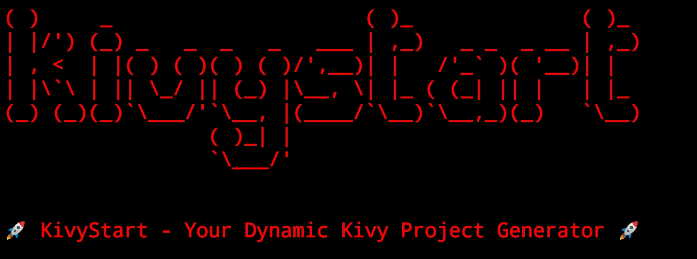

# KivyStart


**KivyStart** is a Python package designed to streamline the creation of project structures for Kivy applications. It provides a standardized, modular, and scalable template to help you kickstart your Kivy projects efficiently.

## 🚀 Features

- **Standardized Project Structure** – Ensures consistency across Kivy projects.
- **Pre-configured Files** – Includes essential configuration and setup files for a smooth development experience.
- **MVC-Like Architecture** – Encourages better code organization and separation of concerns.
- **Customizable Project Setup** – Supports additional configurations for flexibility.

## 🛠 Installation

Clone the repository and install KivyStart:
```
git clone https://github.com/digreatbrian/kivystart
pip install ./kivystart 
```

## 📦 Creating a New Kivy Project

To generate a new Kivy project using KivyStart, run:
```
python -m kivystart makeproject demo DemoApp 

# or

kivystart makeproject demo DemoApp
```

### 💡 Want to explore more options?
Run the following command to see available flags and configurations:

```
python -m kivystart makeproject --help 

# or

kivystart makeproject --help
```

## 📂 Project Structure

KivyStart generates a well-organized directory structure:
```
project_root/ 
├── .git/ # (Optional) Git repository metadata 
├── assets/ # Stores images, fonts, and icons 
├── components/ # Reusable UI components 
│ ├── main_container.py 
│ ├── toolbar.py 
├── controllers/ # Handles business logic & interactions 
├── kv_files/ # Kivy (.kv) files for UI design 
│ ├── main_container.kv 
│ ├── main_toolbar.kv 
│ ├── root_container.kv 
├── models/ # Data models (manual implementation) 
├── utils/ # Utility/helper functions 
├── venv/ # (Optional) Virtual environment 
├── buildozer.spec # (Optional) Configuration for Android packaging 
├── main.py # Entry point of the Kivy application 
├── README.md # Project documentation 
├── requirements.txt # Dependencies list 
├── theme.py # Defines global styles and themes 
```

## 🔍 Folder & File Breakdown

### 📁 .git/ (Optional)

Stores version control metadata when using Git.

### 📁 assets/

Holds static resources like images, fonts, and icons.

### 📁 components/

Contains reusable UI elements. Examples:

**main_container.py** – Main UI container.

**toolbar.py** – Application toolbar with buttons/navigation.

### 📁 controllers/

Manages business logic and communication between UI and models. (Manual implementation required.)

### 📁 kv_files/

Stores .kv files to define UI separately from Python logic. Examples:

**main_container.kv** – Layout for the main container.

**main_toolbar.kv** – Toolbar layout.

**root_container.kv** – Loads/manages other UI components.

### 📁 models/

Stores data models for databases, APIs, or other structured data. (Manual implementation required.)

### 📁 utils/

Includes helper functions for logging, error handling, etc.

### 📁 venv/ (Optional)

A virtual environment for managing dependencies.

### 📄 buildozer.spec (Optional)

Configuration file for Buildozer, used to package the Kivy app into an APK (Android) or other formats.

### 📄 main.py

The entry point of the Kivy application.

### 📄 README.md

Project documentation, including setup, features, and usage.

### 📄 requirements.txt

Lists dependencies. Install them with:
```
pip install -r requirements.txt 
```

### 📄 theme.py

Defines global styles, colors, and fonts for the application.

## 🤝 Contributions Are Welcome!

We appreciate contributions to improve KivyStart! Feel free to submit issues, feature requests, or pull requests.
